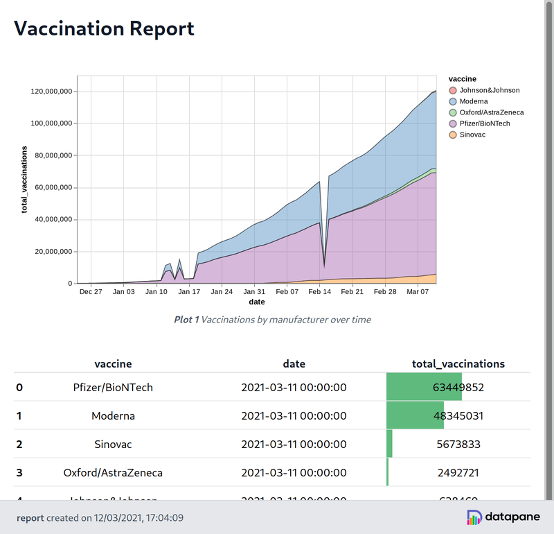
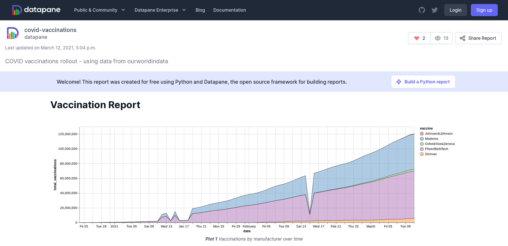

# Welcome to Datapane

## What is Datapane?

Datapane is for people who analyze data in Python and need a way to share their results.

It provides a way to create reports programmatically from components that wrap around the common objects in analyses, such as:

* [Pandas DataFrames](https://pandas.pydata.org/)
* Plots from Python visualization libraries such as [Bokeh](https://bokeh.org/), [Altair](https://altair-viz.github.io/), [Plotly](https://plotly.com/python/), and [Folium](https://python-visualization.github.io/folium/quickstart.html)
* Markdown and text
* General files, such as images, PDFs, JSON data, etc.

Datapane reports are flexible and can also contain pages, tabs, drop downs, and more. 

Once created, reports can be published on the web, dynamically generated in the cloud, or embedded into your own application, where data can be explored, and visualizations can be used interactively.

```python
import pandas as pd
import altair as alt
import datapane as dp

df = pd.read_csv('https://covid.ourworldindata.org/data/vaccinations/vaccinations-by-manufacturer.csv', parse_dates=['date'])
df = df.groupby(['vaccine', 'date'])['total_vaccinations'].sum().reset_index()

plot = alt.Chart(df).mark_area(opacity=0.4, stroke='black').encode(
    x='date:T',
    y=alt.Y('total_vaccinations:Q'),
    color=alt.Color('vaccine:N', scale=alt.Scale(scheme='set1')),
    tooltip='vaccine:N'
).interactive().properties(width='container')

total_df = df[df["date"] == df["date"].max()].sort_values("total_vaccinations", ascending=False).reset_index(drop=True)
total_styled = total_df.style.bar(subset=["total_vaccinations"], color='#5fba7d', vmax=total_df["total_vaccinations"].sum())

dp.Report("## Vaccination Report",
    dp.Plot(plot, caption="Vaccinations by manufacturer over time"),
    dp.Table(total_styled, caption="Current vaccination totals by manufacturer")
).save(path='report.html', open=True)
```




These docs include tutorials and guides on how to use Datapane effectively. 

API docs describing the Python API for building Datapane Reports, along with additional information on the Datapane Teams API can be found at [https://datapane.github.io/datapane/](https://datapane.github.io/datapane/)


## Datapane Public



If you want to share your report on the web, _Datapane Public_ provides a free API and hosted platform for publishing and sharing reports. If you have already [created an account and are signed in](tut-getting-started.md#authentication), you can publish your report, including datasets and plots, in a single Python command

```python
dp.Report(
    dp.Plot(plot), 
    dp.DataTable(df)
).publish(name='Vaccination Report', open=True)  # publish & open report in the browser
```

Once published, you can share your report with your community, class, or friends by sharing the link.



Alternatively, you can embed your published report into social platforms, like Reddit and Medium, where your readers can explore your data and plots interactively without leaving your content, like this:



## Datapane Enterprise

If your team is using the Python data stack for analysis and visualization, but is still relying on a drag-and-drop BI tool to share results, _Datapane for Teams_ provides an API-first way to share reports directly from Python. This enables data teams to use the tools they are gifted at to drive business decisions, and allows stakeholders to self-serve on what the data team is building, instead of going through a backlog.

In addition to providing secure, authenticated report sharing, _Datapane for Teams_ allows automated report generation by allowing data teams to deploy their Python scripts and Jupyter Notebooks to the cloud. Reports can be generated from parameters entered through web forms, on a schedule, or on-demand through our HTTP and Python APIs.

