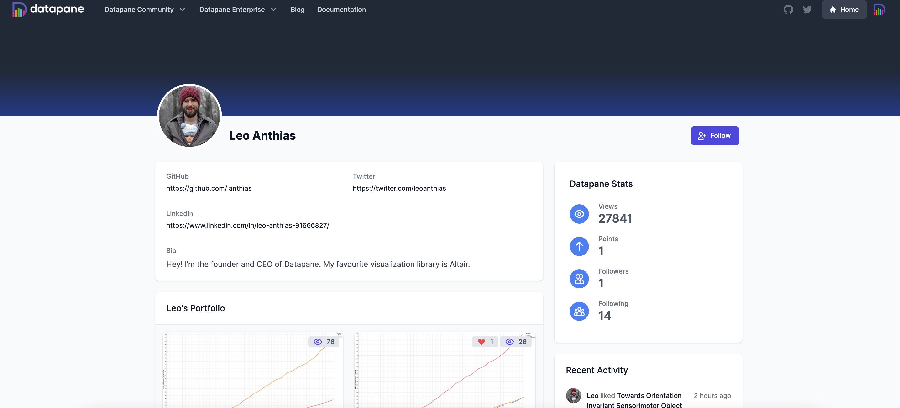
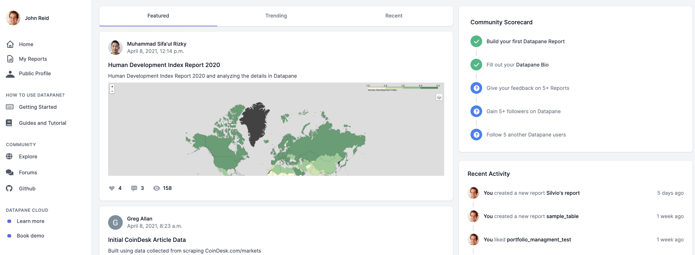
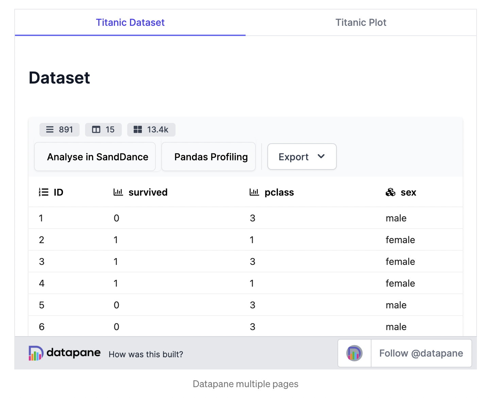
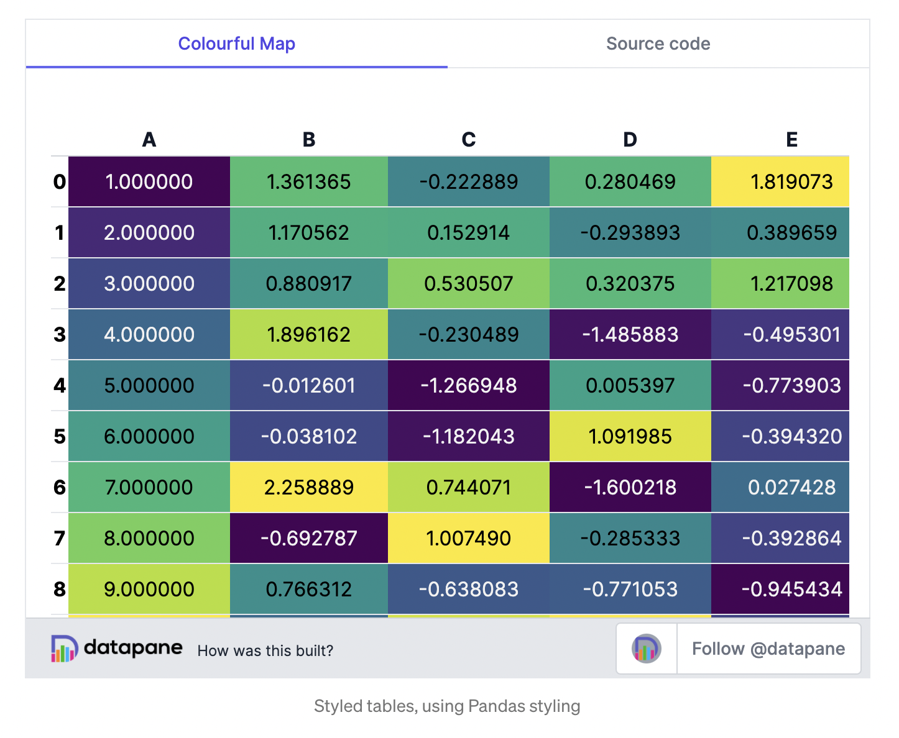
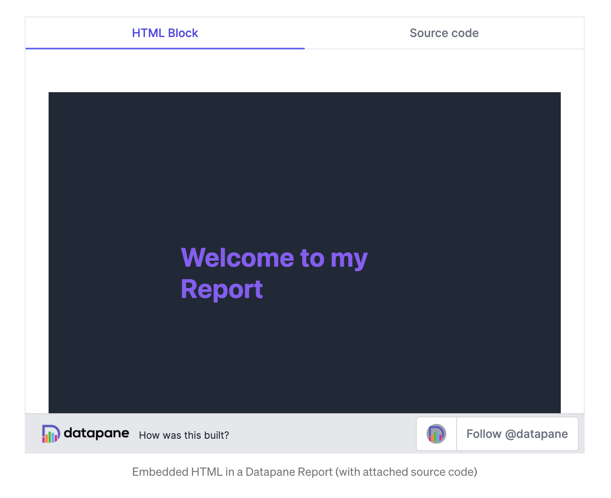
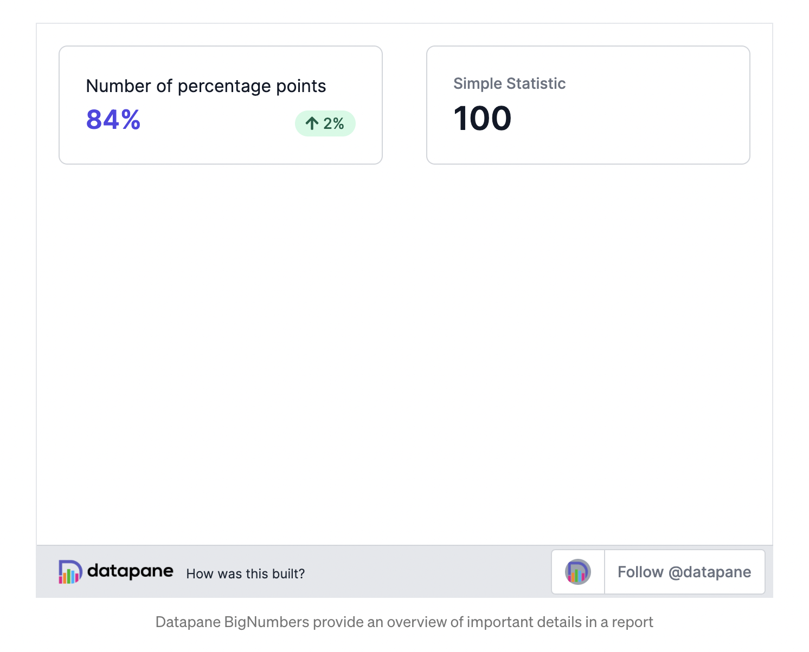

# ✨ Changelog

Check out our [Product Roadmap](https://roadmap.prodpad.com/d37d9988-f04a-11eb-9032-0abbec7104a5) to see what upcoming features we are considering, and submit [new ideas here](https://portal.prodpad.com/21dc45da-edf7-11eb-96ba-06df22ffaf6f)! 

## 21 September 2021

**Python Version 0.12.1**

### **🚀API-first Signup**

In keeping with our vision of being a developer-friendly API-first product, we're launching a new onboarding experience for local client users. After installing Datapane, you'll be prompted to run the following command: 

```text
datapane hello
```

This will run some Python code to generate a local HTML report which demonstrates how the product works. After viewing that local report, you can run the following command to create an account and get an API key for hosting reports: 

```text
datapane signup
```

### **💬 Report Notifications** 

You can now add email recipients to a report, who will receive a screenshot of the first page of the report plus a link back to the hosted report. 


To use this feature, go to the Report Settings page -&gt; Email recipients, and enter your recipient email addresses. Click 'Send Email Now' to send the emails \(note that users will need to have an account to view the full report\).


**Datapane Teams** users can choose to notify their email recipients every time the report is updated. This is great for any kind of regular/automated reporting workflow. 


**🌱Studio plan with Private Report Sharing**

We've renamed our Community account to Studio and added 5 private reports per account. This is great for sharing confidential data and testing Datapane out in your organization. 


To use this feature, go to Report Settings and change your visibility to Private. You can then add email recipients in the 'Email Recipients' section or 'Share' page.  To learn more, see our section on [Uploading and Sharing](reports/publishing-and-sharing/). 

**🐛Bug fixes & improvements**

* Improved `dp.Table` default styling
* Added a SQL query runner to `dp.DataTable` for more advanced filtering and calculation logic
* Fixed a bug where thumbnails weren't being generated for new reports

## 25 August 2021

**Python Version 0.12.0**


This is a breaking change, and you may need to update your reports with the following syntax to ensure they continue working: 


* `report.publish` is now called `report.upload`
* `dp.Markdown` replaced with `dp.Text` for text content
* `dp.Page` must use `title` parameter to set the page title, not `label`
* Objects like `scripts`, `blobs` and `variables` now keep their original name instead of being converted to lowercase slugs, for instance `my variable` won't be renamed to`my_variable`. You may need to update any scripts to use the new names \(or re-add variables / blobs with the older names\). 

### 🔨 **Templates**

Unsure what to build with Datapane? Try creating a report from one of our templates!

* **Python Reports** - view and download source code to run on your own machine
* **Text Reports** - duplicate an existing report & assets, edit markdown, download and run code on your machine

### **🧮 DataTable Improvements**

* Fixed encoding issue mismatch between `dp.Table` and `dp.DataTable`. 
* Allow column autosizing on double-click
* You can now input uppercase strings in column filters 
* `ID` column is no longer added by default, instead row numbers will appear to the left of the first column
* `Select` and `Date` column types added

### **🐛 Other bug fixes & improvements**

* `dp.Select` blocks are now searchable, so they work better with many options
* Report URLs no longer break when you change the title
* Report thumbnails are now shown correctly when the first asset is an image
* Added a product feedback form in left sidebar of Datapane Home
* Per-report styling is now available on Enterprise
* Medium exports no longer require Publishing a report
* Streamlined `Home` and `Gallery` pages
* If you have added code to a report, it will now show in the embed view

## 27 July 2021

**Python Version 0.11.11**

### 🖥 **Add Code**

Datapane now allows you to upload a Jupyter Notebook to your report so that others can reproduce and build on your work. If you're using the Community version, it's a great way to build an audience and show the world your Python skills. For Datapane Teams, it helps to democratize data science, provide reproducibility, and empower your team to create their own reports. 

### **🎨 Report Styling**

We've had a ton of feedback from users wanting to create more custom reports. Now you can set a custom background color, font, and text alignment. Try it on the Report Settings page or through our Python library.

### **🔧 Fixes**

* Fixed the error `DataTable: No objects to concatenate`
* Fixed DataTable numeric column sorting
* Fixed a broken docs link for TextReports
* Removed some unnecessary extra padding on report embeds

### **✨ Improvements**

* Removed signup requirement for 'Request Workspace' form
* Added Google, Github OAuth options on signup page
* Added &gt;, &gt;=, &lt;, &lt;= DataTable column filter options
* Added a Copy button to the Code block for viewers
* Added a Text icon to TextReports for multi-column layouts
* Added 'Previous Page', 'Next Page' to reports with multiple pages
* Improved report comment email notification
* Doubled the allowed document size
* Doubled the limit on `dp.Select` option names
* Support both Jinja v2 and v3

## 3 July 2021

**Python Version 0.11.9**

###  ✍️ Text Report Improvements


Now you can create [text reports](reports/blocks/text-reports.md) directly from the browser! This means it's a lot quicker to write long-form articles and reports. 

We've also changed the syntax for blocks on the text editor - previously inserting a block like Formula would show up as follows:   

`{{block: formula, name: asset-1, value: x^2 + y^2 = z^2}}`

Now, we're using YAML syntax, which allows us to add multi-line content in code and formula blocks, and nest different blocks inside eachother. 

```
  - block: formula
    name: asset-1
    value: |
      x^2 + y^2 = z^2
```

### 🎨 Report Styling & Whitelabelling on Teams

Now you can add your own fonts, colours, custom headers and more on your Datapane Teams reports. This is great for organizations who have brand guidelines to follow, or want to experiment with their own defaults. 


Read the [docs](datapane-teams/styling.md) section for more. 

### Improvements

* Decreased report font size and changed from dark grey to black
* Changed default padding on reports
* Added fullscreen viewing options for embeds
* Show a more informative error message when signing up with an expired email link
* Changed default report visibility to Unlisted

## 6 June 2021

**Python Version 0.11.8**

### 👨‍👩‍👧‍👦 Settings & User Management


Admins on Datapane Teams have a lot more control over their instance, as we've added several new Settings pages:  

**Account**

* View pricing plan
* Customise report sharing timeout
* Set company logo
* Set company name
* Set docker registry credentials

**Team Members**

* Invite a user via email
* Set user role \(admin, editor, viewer\)
* Add new user to group
* See list of pending invites

**Groups**

* Create a group
* Add existing user to group

Check out the section on [managing users ](https://docs.datapane.com/datapane-teams/managing-users)for more. 

### 🏡 On-premise installation

Datapane Teams can now be installed in your own cloud environment \(AWS or GCP\). This is perfect for users with stricter security requirements who want to ensure that confidential data doesn't leave their system. We use docker-compose to ensure that you can get up and running within 15 minutes.

Read our [installation guide](https://github.com/datapane/datapane-onpremise) on Github for more. 

### Improvements

* Better report header design
* See the report visibility \(Public/Private\) on the 'My Reports' page
* DataTable component is now available for offline reports generated via `report.save`
* Live support chat added to hosted Datapane Teams instances
* Clearer signup process for Datapane Teams users

### **Bug Fixes**

* 'More from user' section of a report no longer shows that same report
* Fixed a bug with Bokeh where some report blocks would be repeated

## 23 May 2021

#### Python version 0.11.4

### **Improvements**

* LaTeX equations can now be added to your reports! Check out the [Formula](https://docs.datapane.com/reports/blocks/text-code-and-html#formulas) block for more info. 
* Increased the maximum size of a report from 25MB to 100MB
* Scripts can now specify environment variables directly from their `datapane.yaml` file - these can be static value or user variables that are dynamically injected into your script e.g. DB parameters. [See the docs](datapane-teams/configuration-and-dependencies.md#environment-variables) for more info!
* Teams users can now set their private report sharing timeout \(previously this was fixed at 48 hours\)

### **Bug Fixes**

* Sharing a private report link sometimes broke due to an extra \# being appended to the URL

## 19 April 2021

#### Python version 0.11.0

### **🕸 Web editor** 

One of the challenges our users face is adding text to Python reports - it sucks to have to write long text strings and markdown directly from within your Python script/notebook. To solve this challenge, we've introduced a new web-based Markdown editor where you can edit the report once it's published. Simply write Markdown and insert your Python assets from the right sidebar. You can also use some of our nifty extra blocks, like LaTeX, HTML, BigNumbers etc. This makes it **much** easier to write blogs, articles, tutorials and other long-form content directly on [Datapane.com](http://datapane.com)!


## **31 March 2021**

### **👤 Profile redesign** 

One of the things Datapane users struggled with was finding a good place to showcase their skills to the community or prospective employees. They had GitHub for code and libraries, Medium for blogging, Kaggle for code-heavy ML, and LinkedIn for their work — but where does their data visualization and storytelling identity live? We’ve improved profiles on Datapane so users can showcase their skills. This might be the place where you link to from your CV or which people discover when they Google you. If you’re a current Datapane user, be sure to [update your bio](https://datapane.com/settings) and choose some high quality reports so that it does you justice!



### **🗞 Newsfeed**

Our first versions of Datapane didn’t take into account that users wanted to talk to **learn from each other** — the product was quite insular to each individual user. Our first change to solve this is to add a newsfeed so that you can see what is happening in the Datapane Community, get more visibility on your reports, and learn techniques from others. Check your your [own Datapane newsfeed](https://datapane.com/home). As your reports increase in visibility, it’s more important than ever to include proper context and source-code, so the community can see how you’ve built your report and offer any tips.



### **🦯 Guides** 

We have added a new [**Guides and Tutorials**](https://datapane.com/guides-and-tutorials/) section to the product, which you can check out. It’s a work in progress, and we would love community-contributions. Want to show-case your skills? Create a guide or tutorial as a Datapane report and tag it like this:

```text
dp.Report(...).publish(name='My guide', tags=['guide'])
```

And it will appear in our guides section. Stay tuned as we improve the knowledge sharing aspects of the product, which we know are really important to many of you.

## 23 December 2020

#### Python version 0.**9**.0

### **✍️ Text-centric reports**

One of the things people struggled with when creating text-heavy reports on Datapane was having to write reports as lists of strings and plots. Interspersing Markdown and plots works well if you have a few headings, but it’s hard when you are writing a text-rich report — such as a blogpost or article. To make this easier, our first idea was to build a web text-editor; but, from speaking to users, we learned that many of them were comfortable with Markdown and had a local editor already.

In response to this feedback, we’ve added a `format` option, which allows you to write a single block of Markdown \(either in your report, or in a separate file\), and template it with your other blocks.

To do this, use double braces to specify where you want your other blocks to appear throughout your text. Alternatively, you can write your whole post in your favourite local Markdown editor, and import the file:

```text
dp.Report(
  dp.Text(file='markdown.md').format(
    plot=plot,
  )
).publish(name='altair_example')
```

We hope that this will made it easy for users to build text-rich whitepapers, articles, and blogposts using Markdown, Python, and Datapane.

### **📄 Pages and Layouts**

When we first released Datapane, it only supported a list of blocks and a single column — not a million miles off of a Jupyter Notebook. Many users needed a way to build more flexible grid components, and in October we released our layout features to allow the building of grid layouts.

We’re pleased to announce we’re adding a great new feature to this: Pages. Pages do what they say in the tin, and allow you to have multiple pages in your report which your users can navigate through tabs — without writing any HTML or CSS!

We’ve been using this internally to create multiple scenarios, add full source code to reports, and single reports which previously would have had to be multiple reports.


### **🗂 Dropdowns and Tabs**

Pages work at the top-level of the report, and many users also wanted to have dynamic components inside of reports — such as tabs and drop-downs.

What if we want our titanic data above, but want to allow the user to choose whether they wanted to view the whole dataset, or a description of the dataset? Instead of making you include them both side by side, we’ve added `dp.Select`, which takes other blocks and turns them into tabs or drop downs.



This is also a great block for showing the source code behind a plot or dataset for documentation \(which most of your viewers may not want to see\). For instance, to see the source code of the `Select` component, click on the "Source code" tab.

Part of Datapane’s mission is to be completely standalone, so none of these interactive elements require you to run or maintain a Python server — your report is pure HTML. You can publish them on [datapane.com](https://datapane.com/) for free, embed them into your own site, or export them and host them on a static site such as GitHub pages.

### **🧮 Better Tables**

Our primary Table component was built for large data with interactive filtering and sorting. We thought this was going to be the most common format, but learned that it isn’t always the best option — many users wanted more styled display-focused tables, where they could show correlations, embed bar charts and histograms, and highlight anomalies, instead of a way to display millions of cells.

Many users were using our Markdown component to build a table, and we looked at building our own, before settling on supporting Pandas HTML tables. This allows us to support [Pandas Styling](https://pandas.pydata.org/pandas-docs/stable/user_guide/style.html) and is a natural fit for our HTML reports, making it simple to build beautiful styled tables like this:



As part of this, we are making this the default `Table` component, and renaming our interactive component for larger datasets as `DataTable`.

### **HTML**

Although users like being able to create reports without touching HTML, sometimes it’s helpful to be able to pull in another UI library or custom component — for instance, maybe you want to include your company’s logo or styling. To allow this for power users, we’ve added an HTML component which you can use anywhere in your Datapane report. You can also use the [dominate library](https://github.com/Knio/dominate/) to create HTML directly from python code.



### **Big Number**

Sometimes one statistic or KPI is the most important thing in your report — and we had a few users who were missing this from their BI tools. To save you the trouble of building one using HTML, we’ve included a `BigNumber` component for you \(built with the amazing [TailwindCSS](https://tailwindcss.com/) library\).




