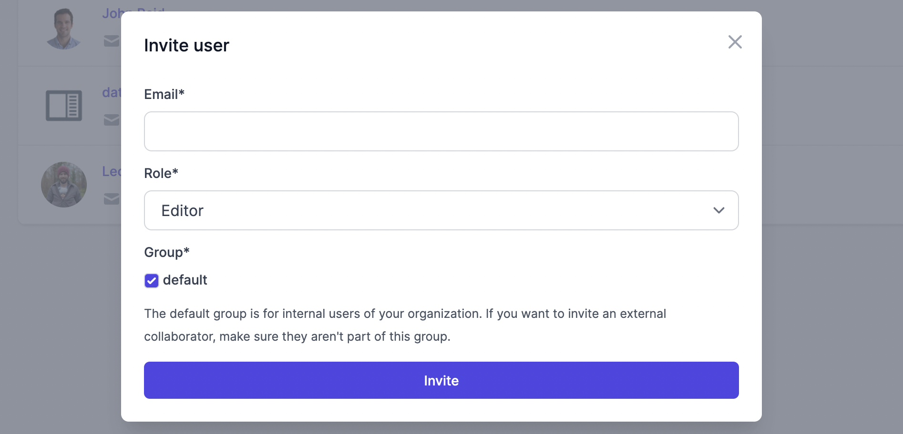

# Managing Users

You can invite team members to your instance so your whole team has access to a shared environment for reports and scripts. 


Datapane doesn't charge on a per-seat or per-user basis, so you can add as many people to your instance as you like!


### Inviting Users

If you're an Admin logging in to your instance for the first time, you'll be prompted to invite team members by email. You can also invite users later by going to Settings -&gt; Manage Users. The invited user will receive an email with a secure signup link valid for 72 hours. 

### Roles and groups

Every user must be assigned to one of our three system roles: 

1. **Viewer** - can view reports and run scripts 
2. **Editor** - all permissions of viewer, plus creating reports and scripts
3. **Admin** - all permissions of editor, plus settings, user management and billing

The default group is automatically created by the server and is for internal users. If you need to invite an external collaborator for a specific report, see the section on [Groups](https://docs.datapane.com/datapane-teams/authentication-and-sharing#groups). 

### Advanced

If you need to delete a user, click on the 'Advanced Settings' button next to the user's name. This will take you to the Django Admin Panel. We recommend unchecking the box under Permissions -&gt; 'Active' instead of deleting the user permanently, as this will trigger a cascading deletion of all the objects and reports that user ever created. 


Deactivated users won't be able to log into your instance, or upload any further reports and scripts. 


