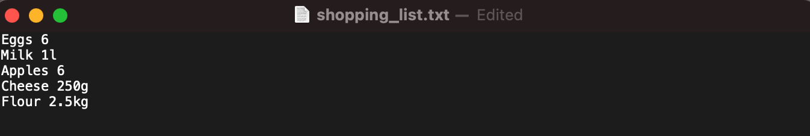
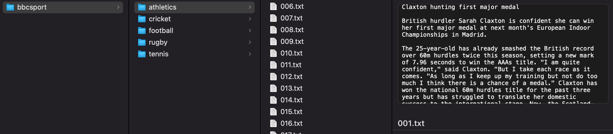
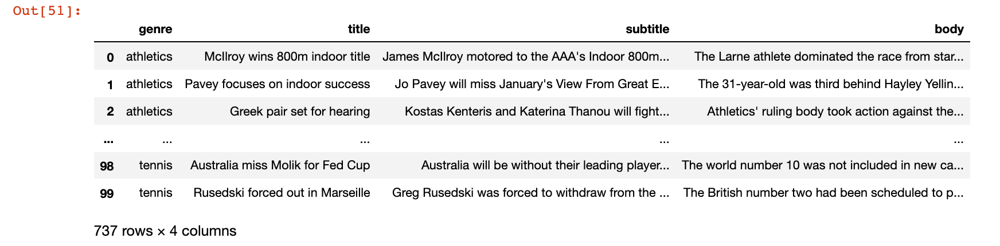
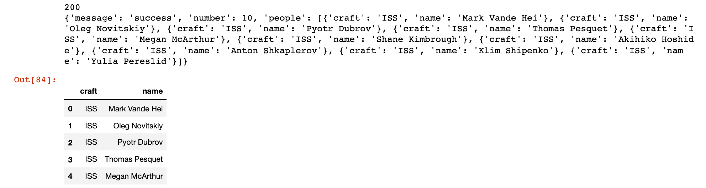
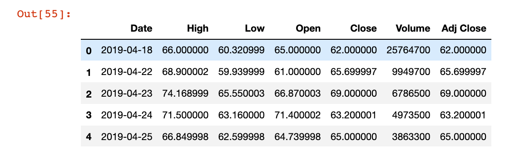
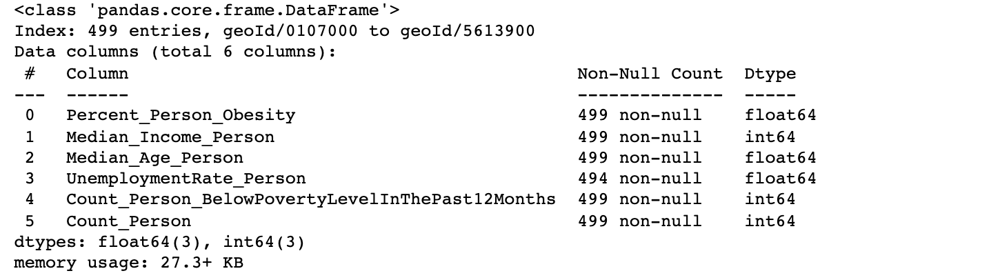
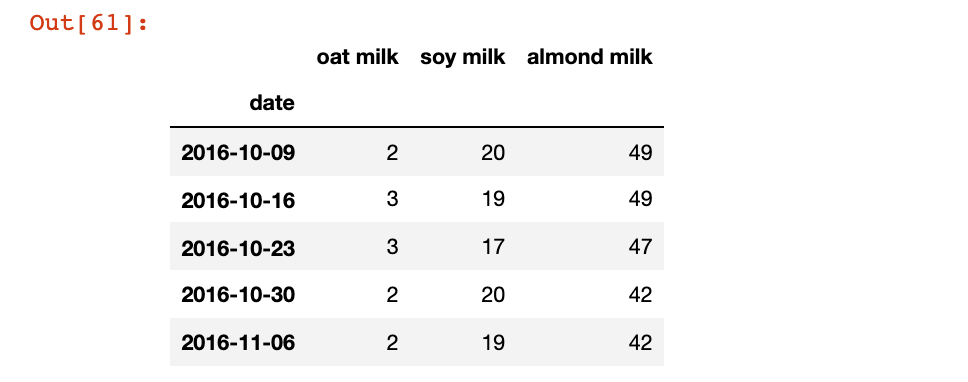

# Accessing data in Python

## Introduction

To build Datapane reports, you'll usually start by importing data into your Python environment. This is an overview of the main data sources and how to access them: 

1. Local files
2. Databases
3. APIs
4. Data access libraries

The only major requirement is installing the `pandas` library: 



```
$ pip install pandas
OR
$ conda install pandas
```



```
!pip install pandas
```



## Local files

Often the data you need is stored in a local file on your computer. Depending on where you're running your Python environment, you can either specify the filename as a [relative or absolute path](https://www.earthdatascience.org/courses/intro-to-earth-data-science/python-code-fundamentals/work-with-files-directories-paths-in-python/): 

```python
# Absolute path
file1 = "~/Users/johnreid/Documents/my_project/data/example.csv"
# Relative path, assuming current working directory is my_project
file2 = "./data/example.csv"
```

### **CSV files**

CSVs are a popular choice for storing tabular data, here we'll look at a population dataset from[ Our World in Data](https://ourworldindata.org/grapher/population-by-country) using `pd.read_csv`: 

```python
import pandas as pd

csv_file = "/Users/johnreid/Downloads/population-by-country.csv"
df_from_csv = pd.read_csv(csv_file)
df_from_csv.info()
```

After importing the data, it's helpful to run `df.info()` to understand how your data is structured e.g. how many rows, columns and non-null values you have. Running that code gives us the following output: 



If you keep getting  a`FileNotFoundError`, try renaming your filename to replace spaces with underscores e.g. "Financial Sample.xlsx" becomes "Financial_Sample.xlsx". 


### **Excel files**

You need to be a bit more cautious with Excel files, because they may contain more than one sheet of data and complex visual formatting e.g. extra header rows. Otherwise the syntax is pretty similar - here's a [financial data](https://go.microsoft.com/fwlink/?LinkID=521962) example: 

```python
import pandas as pd
excel_file = "/Users/johnreid/Downloads/Financial_Sample.xlsx"
df_from_excel = pd.read_excel(excel_file, sheet_name = "Sheet1")
df_from_excel.info()
```

### **Text**

Text files often need more data processing - start by looking at how the data is stored and how you'd like to represent it in Python. From there, you can write code to transform textual input into a dataframe. Let's use a shopping list example, with each line containing an item and a quantity: 



To convert that to a dataframe, you can try the following: 

```python
shopping_list = "/Users/johnreid/Downloads/shopping_list.txt"

results = []

with open(shopping_list) as f:
    line = f.readline()
    while line:
        results.append(line.strip().split(" "))
        line = f.readline()

f.close()

df_from_textfile = pd.DataFrame(results, columns = ["Item", "Quantity"])
```

We read the lines one-by-one, strip extra whitespaces and split the line into two parts. When we create a dataframe, we also need to assign column names. 

### **Multiple files / folders**

 Let's combine a couple of things that we've learned to extract data from the [BBC Sport text dataset](http://mlg.ucd.ie/datasets/bbc.html). 



We have 5 subfolders, each with around 100 files. Each file starts with a headline, followed by the body of the article. Our goal will be to combine all these files into a single dataframe with 'Title', 'Subtitle', 'Body' and 'Genre' columns. The `glob` library comes really in handy: 

```python
import glob
import pandas as pd

base_path = "/Users/johnreid/Downloads/bbcsport/"
genres = ["athletics", "cricket", "football", "rugby", "tennis"]

def read_and_split_file(filename):
    with open(filename, 'r', encoding="latin-1") as f:
        lines = f.readlines() # Get lines as a list of strings
        lines = list(map(str.strip, lines)) # Remove /n characters
        lines = list(filter(None, lines)) # Remove empty strings
    return lines

def get_df_from_genre(path, genre): 
    files = glob.glob(path + genre + "/*.txt")
    titles = []
    subtitles = []
    bodies = []

    for f in files: 
        lines = read_and_split_file(f)
        titles.append(lines[0]) # First line is the title
        subtitles.append(lines[1]) # Second line is the subtitle
        bodies.append(' '.join(lines[2:])) # Combine all the rest

    return(pd.DataFrame({
            'genre': genre, 
            'title': titles, 
            'subtitle': subtitles, 
            'body': bodies
        })
    )

final_df = pd.concat([get_df_from_genre(base_path, g) for g in genres])
final_df
```

Note that you can concatenate multiple dataframes together using `pd.concat`. 

Running that code gives us the following output: 



## Databases

Most organizations store their business-critical data in a [relational database](https://en.wikipedia.org/wiki/Relational_database) like Postgres or MySQL, and you’ll need to know **S**tructured **Q**uery **L**anguage (SQL) to access or update the data stored there.

### SQLite

SQLite is an embedded database that is stored as a single file, so it's a great place to start testing out queries. Here we'll show an example of connecting to a SQLite file of the [Chinook](https://github.com/lerocha/chinook-database) database: 

```python
import pandas as pd
import sqlite3 as sql

conn = sql.connect('/Users/johnreid/Downloads/chinook.db')

# First pattern - turn query directly into dataframe: 
df1 = pd.read_sql_query("SELECT * FROM invoice", conn)

# Second pattern - get row-level data, but no column names
cur = conn.cursor()
results = cur.execute("SELECT * FROM invoice LIMIT 5").fetchall() 
df2 = pd.DataFrame(results)
```

### Remote databases

Connecting to a remote database like Postgres, Redshift, or SQLServer uses mostly the same syntax but requires access credentials. For security reasons, it's best to store these credentials in a config file and load them into your Python script. You can create a separate `.py` file like this: 


```python
host = "localhost"
database= "suppliers"
user = "postgres"
password = "SecurePas$1"
```


and then import it into your Python script as follows (you'll also need the `psychopg2` library): 

```python
import psycopg2
import config

conn = psycopg2.connect(
    host=config.host,
    database=config.database,
    user=config.user,
    password=config.password)
    
## Run queries to your heart's delight!
```


Make sure to keep your `config.py` file safe and don't upload it elsewhere - you can add it to your `.gitignore` to make sure it doesn't get included in git commits. 


### **SQLAlchemy**

If you want a more ‘pythonic’ way of querying a database, try the [SQLAlchemy](https://www.sqlalchemy.org) library, which is an Object-Relational-Mapper. It’s typically used for applications so that developers don’t have to write pure SQL to update their database, but you can use it for querying data too!

Here’s an example using the same Chinook music store database: 

```python
import sqlalchemy as db
import pandas as pd

engine = db.create_engine('sqlite:///chinook.db')
connection = engine.connect()
metadata = db.MetaData()
invoice = db.Table('invoice', metadata, autoload=True, autoload_with=engine)

# Get the first 10 invoices from the USA
query = (
    db.select([invoice])    
    .filter_by(billing_country = 'USA')
    .limit(10)        
    )
    
df = pd.read_sql(query, engine)
```

In this code we connect to the database, then set up some tables & metadata in SQLAlchemy. Once that’s defined, we can write a query in a more ‘pythonic’ way and read the results directly to a Pandas dataframe. Running that code gives the following output: 


## APIs 

Sometimes you'll need to access data from a particular platform your company uses, like Hubspot, Twitter or Trello. These platforms often have a public API that you can pull data from, directly inside your Python environment. 

The basic idea is you send a request (which may include query parameters and access credentials) to an endpoint. That endpoint will return a response code plus the data you asked for (hopefully). The most [common response codes](https://www.restapitutorial.com/httpstatuscodes.html) are: 

* `200`: Everything went okay, and the result has been returned.
* `301`: The server is redirecting you to a different endpoint. This can happen when a company switches domain names, or an endpoint name is changed.
* `400`: The server thinks you made a bad request. This can happen when you don’t send along the right data, among other things.
* `403`: The resource you’re trying to access is forbidden: you don’t have the right permissions to see it.
* `404`: The resource you tried to access wasn’t found on the server.
* `503`: The server is not ready to handle the request.

You'll need to look at the API documentation to understand what data fields are available. The data will usually be returned in JSON format, which allows for deeply-nested data. Let's do a minimal example using the [OpenNotify](http://open-notify.org/Open-Notify-API/People-In-Space/) API, which tracks all the people currently in space: 

```python
import requests

response = requests.get("http://api.open-notify.org/astros.json")
print(response.status_code)
print(response.json())

res = pd.DataFrame(response.json()["people"])
res.head()
```

Running that code gives us the following output: 



From here, try including query parameters or access credentials for your favourite API! 


If you don't want to deal with JSON you can try searching for a Python library for that API - these are usually open-source and maintained by the company or third parties. 


## Data Access Libraries

### **Pandas_datareader**

[Pandas_datareader](https://pandas-datareader.readthedocs.io/en/latest/index.html) is a great way to pull data from the internet into your Python environment. It is particularly suited to financial data, but also has some World Bank datasources. To get Zoom's daily share price over the past few years, try the following: 

```python
!pip install pandas_datareader
from pandas_datareader import data
import datetime as dt

# Only get the adjusted close.
zm = data.DataReader("ZM", 
                       start='2019-1-1', 
                       end=dt.datetime.today(), 
                       data_source='yahoo').reset_index()

zm.head()
```

Running that code gives us the following output: 



### **DataCommons**

[Datacommons](https://datacommons.org) is a project by Google providing access to standardized and cleaned public datasets. The underlying data is represented in a graph format, making it really easy to [query and join data](https://towardsdatascience.com/exploring-datacommons-the-api-powering-google-search-afc366ec242b) from many different datasources e.g. the US Census, World Bank, Wikipedia, Centre for Disease Control and more. Here's a basic example: 

```python
!pip install datacommons datacommons_pandas --upgrade --quiet

import datacommons, datacommons_pandas as dc
import pandas as pd

city_dcids = dc.get_property_values(["CDC500_City"], "member", limit=500)["CDC500_City"]

cdc500_df = dc.build_multivariate_dataframe(
    city_dcids,
    [
        "Percent_Person_Obesity",  # Prevalence of obesity from CDC
        "Median_Income_Person",
        "Median_Age_Person",
        "UnemploymentRate_Person",  # Unemployment rate from BLS
        "Count_Person_BelowPovertyLevelInThePast12Months",  # Persons living below the poverty line from Census
        "Count_Person",  # Total population from Census
    ],
)

cdc500_df.info()
```

Running that code gives us the following: 



### **PyTrends (Google Trends)**

[PyTrends](https://github.com/GeneralMills/pytrends#interest-over-time) is an unofficial but useful library for querying [Google Trends](https://trends.google.com/trends/explore?date=today%205-y\&q=oat%20milk,soy%20milk,almond%20milk) data - here's a simple example: 

```python
import pandas as pd
from pytrends.request import TrendReq

pytrends = TrendReq()
keywords = ["oat milk", "soy milk", "almond milk"]
pytrends.build_payload(keywords, cat=0, geo='', gprop='') # Get data from the last 5 years
top_queries = pytrends.interest_over_time()[keywords]

top_queries.head()
```

Running that code gives us the following output: 



### **Kaggle**

Kaggle is a data science community that hosts a lot of datasets and competitions for learning Python. You can download some of these datasets to play around with through their command-line interface (note: you'll need to sign up for a Kaggle account). For example, say we want to download some [Zillow economics data](https://www.kaggle.com/zillow/zecon): 



```
$ pip install kaggle
$ export KAGGLE_USERNAME=datadinosaur
$ export KAGGLE_KEY=xxxxxxxxxxxxxx
$ kaggle datasets download zillow/zecon
$ unzip zecon.zip
```



This will download a zipped file of the datasets, and then uncompress them. From there, you can open them as local files with Pandas: 

```python
import pandas as pd

csv_file = "/Users/johnreid/Downloads/Zip_time_series.csv"
df_from_csv = pd.read_csv(csv_file)
df_from_csv.info()
```

To learn more, check out the [Kaggle API documentation](https://github.com/Kaggle/kaggle-api).  
