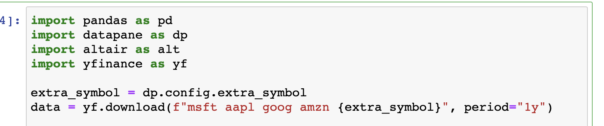

# 📝 Turn a Jupyter Notebook into a hosted web form

## Writing your analysis

Datapane works with existing notebooks and python scripts. In this example, I have a Jupyter Notebook where I am plotting some stock prices. 


## Adding Datapane

Firstly, we import the datapane Python library, and add a single method, `render`, to our notebook. From this method we return a [**Report**](), which tells Datapane the plots and datasets we want presented to the end-user when they run our script. Datapane has different components which you can include in your reports, such as tables, plots, pivot tables, and text. In this example, I'm just including my dataset and plot, which I built using the Python library [altair](https://altair-viz.github.io/).


## Deploying your analysis

To turn this into a script called **stock\_analysis** on Datapane you use our CLI.

```text
datapane script upload analysis.ipynb --name=stock_analysis
```

  
Once uploaded, stakeholders can now run our script using a web form.


  
Each time our script is run, it generates a new **Report**, which contains the plot and dataset. If the code fails for any reason, it throws an error instead.


## Adding interaction

It's often useful to pass arguments into your script to make it interactive: scripts on Datapane can take user inputs, which are available in your analysis on the config object.



After adding this value, I need to update my form using the CLI, and a user will be able to add the field when they run the form. Optionally, you can also specify a **schema** for your form in a YAML file \(datapane.yaml\), which dictates which fields are presented to the user.

```text
parameters:
  - name: "extra_symbol"
    type: "string"
```

Once we've changed our script locally, we need to push the new version to Datapane.

```text
datapane script upload analysis.ipynb
```

The form for users will now appear as follows:


## Next steps

Once a report has been generated by your script, it can be embedded into other platforms, such as your web app or wiki. In this example, I'm embedding it into my Notion document. 


  
  
  


