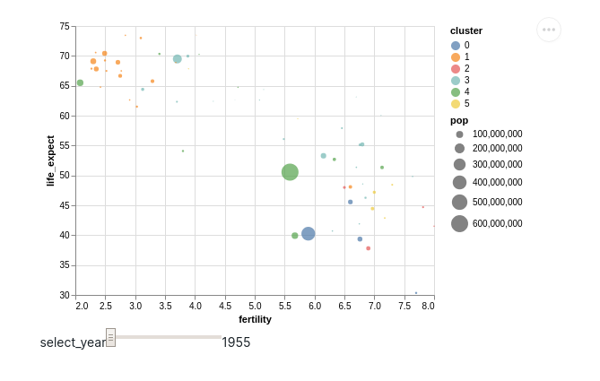
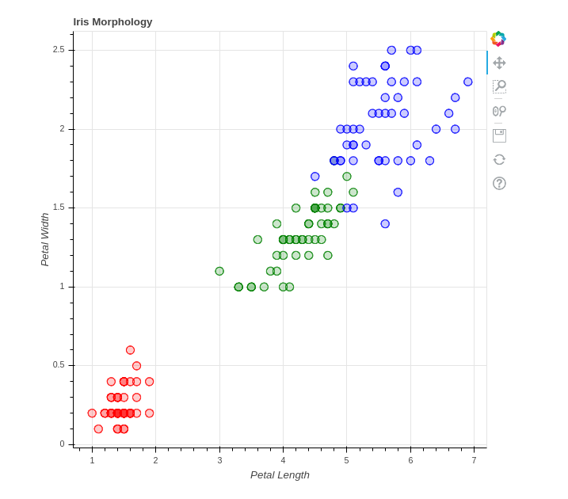
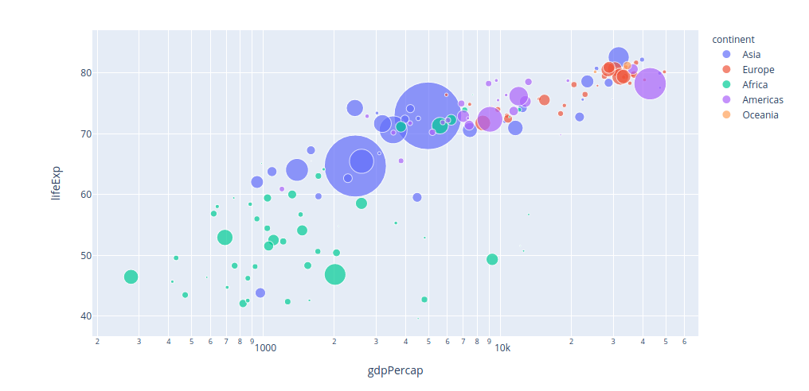
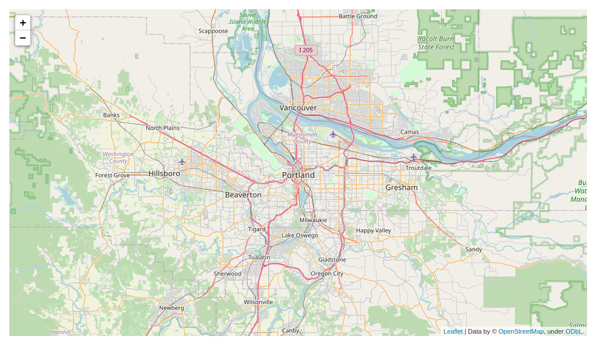
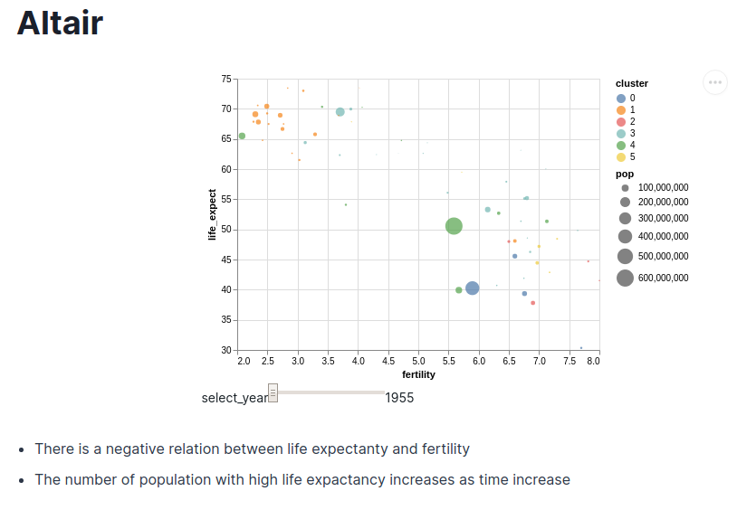
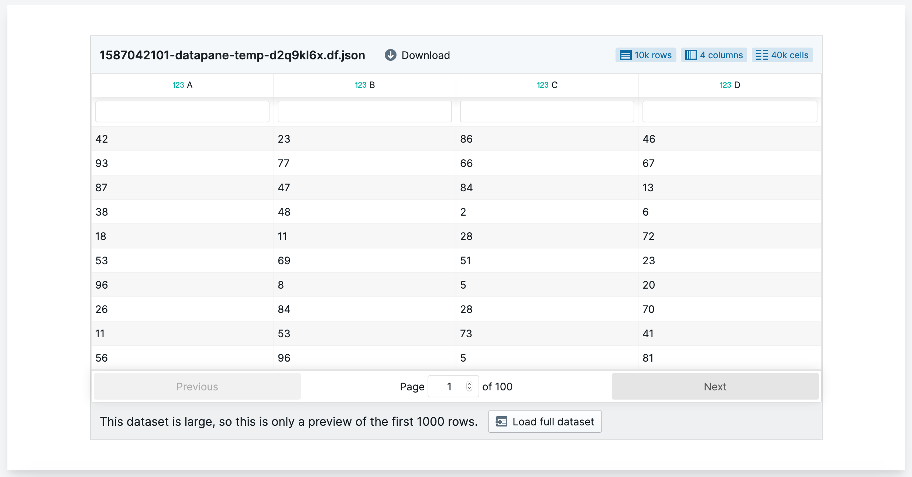
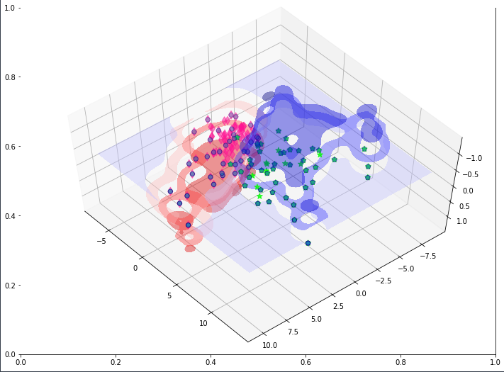

# Components

## Overview

Components are used to create [Reports](./). Components are compatible with Python objects, such as Pandas DataFrames, visualisations, and Markdown. We are always adding new components, and if you have some ideas on what you would like to use in your reports, please [open an issue on GitHub](https://github.com/datapane/datapane).

## Plot

The plot component takes a supported plot object and renders it in your report.

Currently, supported libraries are:

* Matplotlib and seaborn figures
* Plotly plots
* Bokeh plots
* Altair plots
* Folium plots
* Files and images

### Altair

[Altair](https://altair-viz.github.io/) is a declarative statistical visualization library for Python, based on [Vega](http://vega.github.io/vega) and [Vega-Lite](http://vega.github.io/vega-lite). Altair’s API is simple, friendly and consistent and built on top of the powerful [Vega-Lite](http://vega.github.io/vega-lite) visualization grammar. This elegant simplicity produces beautiful and effective visualizations with a minimal amount of code.

To get started using Altair to make your visualizations, begin with Altair's [Documentation](https://altair-viz.github.io/)

```python
import altair as alt
import datapane as dp
from vega_datasets import data as vega_data
gap = pd.read_json(vega_data.gapminder.url)

select_year = alt.selection_single(
    name='select', fields=['year'], init={'year': 1955},
    bind=alt.binding_range(min=1955, max=2005, step=5)
)
alt_chart = alt.Chart(gap).mark_point(filled=True).encode(
    alt.X('fertility', scale=alt.Scale(zero=False)),
    alt.Y('life_expect', scale=alt.Scale(zero=False)),
    alt.Size('pop:Q'),
    alt.Color('cluster:N'),
    alt.Order('pop:Q', sort='descending'),
).add_selection(select_year).transform_filter(select_year)

dp.Report(dp.Plot(alt_chart)).publish(name='time_interval')
```



### Bokeh

Bokeh is an interactive visualization library which provides elegant, concise construction of versatile graphics, and affords high-performance interactivity over large datasets. 

To get started using Bokeh to make your visualizations, begin with Bokeh's [User Guide](https://docs.bokeh.org/en/latest/docs/user_guide.html#userguide).

```python
from bokeh.plotting import figure, output_file, show
from bokeh.sampledata.iris import flowers
import datapane as dp 

# Create scatter plot with Bokeh
colormap = {'setosa': 'red', 'versicolor': 'green', 'virginica': 'blue'}
colors = [colormap[x] for x in flowers['species']]

bohek_chart = figure(title = "Iris Morphology")
bokeh_chart.xaxis.axis_label = 'Petal Length'
bokeh_chart.yaxis.axis_label = 'Petal Width'

bokeh_chart.circle(flowers["petal_length"], flowers["petal_width"],
         color=colors, fill_alpha=0.2, size=10)

output_file("iris.html", title="iris.py example")

# View the plot
dp.Report(dp.Plot(bokeh_chart)).preview()

# Publish the report
dp.Report(dp.Plot(bokeh_chart)).publish(name='bokeh_plot')
```



### Plotly

[Plotly's Python graphing library](https://plotly.com/python/) makes interactive, publication-quality graphs.

```python
import plotly.express as px
import datapane as dp

df = px.data.gapminder()

plotly_chart = px.scatter(df.query("year==2007"), x="gdpPercap", y="lifeExp",
	         size="pop", color="continent",
                 hover_name="country", log_x=True, size_max=60)
plotly_chart.show()

dp.Report(dp.Plot(plotly_chart)).publish(name='bubble')
```



### Folium

[Folium](https://python-visualization.github.io/folium/) makes it easy to visualize data that’s been manipulated in Python on an interactive leaflet map. It enables both the binding of data to a map for `choropleth` visualizations as well as passing rich vector/raster/HTML visualizations as markers on the map.

The library has a number of built-in tilesets from OpenStreetMap, Mapbox, and Stamen, and supports custom tilesets with Mapbox or Cloudmade API keys. 

```python
import folium
import datapane as dp 

m = folium.Map(location=[45.5236, -122.6750])


dp.Report(dp.Plot(m)).publish(name='folium_map')
```



## Markdown

**Markdown** is a lightweight markup language that allows you to include text in your report.

```python
import datapane as dp

dp.Report(dp.Markdown("My awesome markdown"))
```

To include more sentences and format the words, use `"""Some words"""`

```python
import datapane as dp

report = dp.Report(dp.Markdown( "# Altair"),
         dp.Plot(alt_chart),
         dp.Markdown("""
* There is a negative relation between life expectanty and fertility
* The number of population with high life expactancy increases as time increase
          """)
report.publish(name = 'results')

```



Check [here](https://github.com/adam-p/markdown-here/wiki/Markdown-Cheatsheet) for more information on how to format your text with markdown.

## Code

You can also share your code using `dp.Markdown` like below

```python
code = dp.Markdown(f'''
```df = data.reset_index().melt('Date', var_name='symbol', value_name='price')

base_chart = alt.Chart(df).encode(x='Date:T', y='price:Q', color='symbol').interactive()

chart = base_chart.mark_line() if plot_type == 'line' else base_chart.mark_bar()```
''')

dp.Report(code).publish(name='report_with_code')
```

## Table

The Table component takes a pandas DataFrame and renders an interactive, sortable, searchable table in your Datapane report. Viewers can also download the table from the website. Tables can typically render datasets up to 2-3m cells without performance problems. 


By default, a Table only displays the first 1000 rows, and gives the user the option to load the entire dataset.


```python
import datapane as dp
import pandas as pd

df = pd.DataFrame({
    'A': np.random.normal(-1, 1, 5000),
    'B': np.random.normal(1, 2, 5000),
})

table = dp.Table(df)
report = dp.Report(table)
report.publish(name='sample_table')
```



## File and Image

Datapane also enables you to share files and images. For example, to share your image, simply use `dp.File` like below

```python
dp.File(file=dp.Path('./image.png'))
```

And your image would appear on Datapane report automatically!



## PivotTable


Coming soon!


