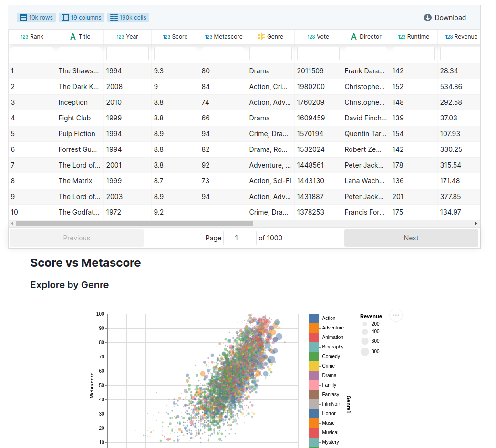
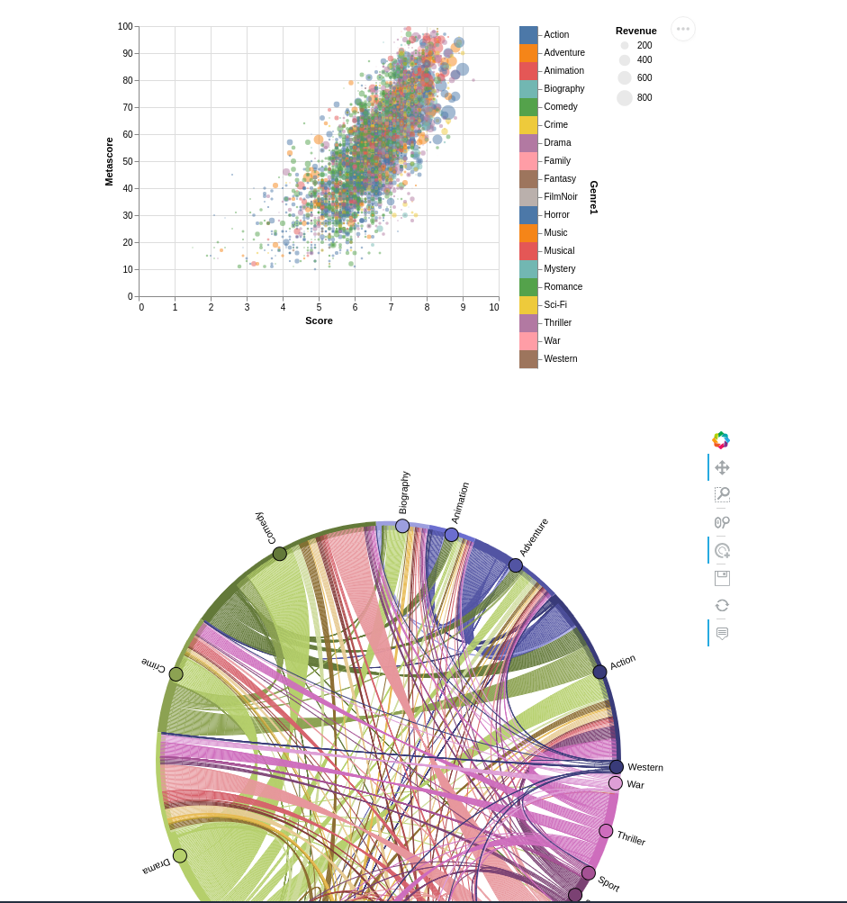
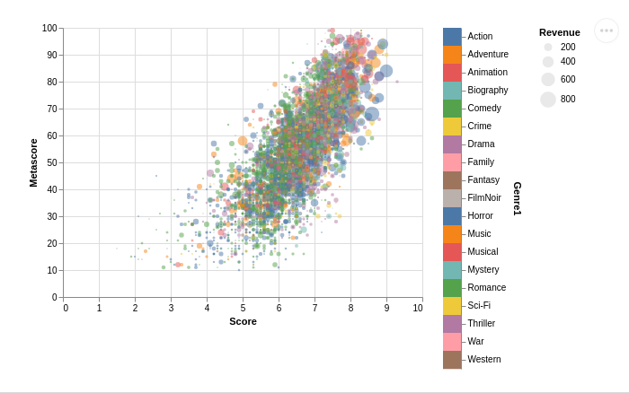
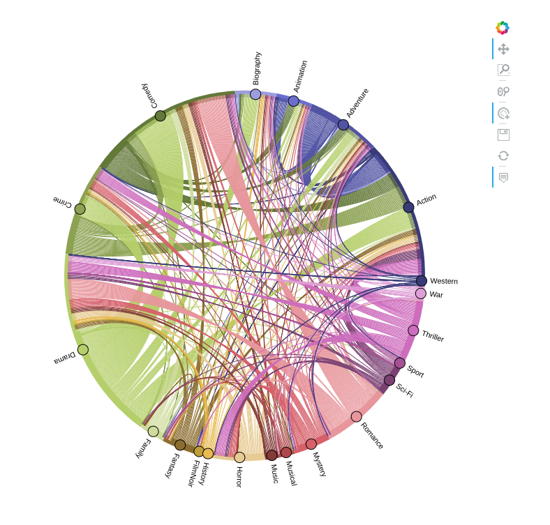

# Share or Embed Individual Component of a Multi-component Report

## Overview

Most often time, your report will have different components. You may wish to access a specific component to either share or embed it separately.

Instead of creating a report for each component, you can access to each component in the report by specifying the component in the report link.

## Access A Specific Component Type

### Component Types

There are 4 component types you can specify in the link to access different components

* `Table` : Extract dataframe 
* `Plot` : Extract plots
* `Text` : Extract markdown
* `File` : Extract files or images

### How to Change the Link of the Report to  Access A Specific Component Type 

Let's say there are both markdown and plot in your report, you may want to share the plots in your report. Simply add `/?blocksquery=//Plot` at the end of the report link.

For example, to extract the plots in this report: [https://datapane.com/ryancahildebrandt/reports/movies\_dashboard\_3496f91c/](https://datapane.com/ryancahildebrandt/reports/movies_dashboard_3496f91c/)

we add `/?blocksquery=//Plot`at the end of the link like this: [https://datapane.com/ryancahildebrandt/reports/movies\_dashboard\_3496f91c/embed/?blocksquery=//Plot](https://datapane.com/ryancahildebrandt/reports/movies_dashboard_3496f91c/embed/?blocksquery=//Plot). Now we will just see the plot components!

### Access a Specific Component

If you want to solely include the first plot of the report, simply add `/?blocksquery=//Plot[1]` at the end of the link. 

For example, this link [https://datapane.com/ryancahildebrandt/reports/movies\_dashboard\_3496f91c/?blocksquery=//Plot\[1\]](https://datapane.com/ryancahildebrandt/reports/movies_dashboard_3496f91c/embed/?blocksquery=//Plot[1]) will give you the first plot

And this link: [https://datapane.com/ryancahildebrandt/reports/movies\_dashboard\_3496f91c/?blocksquery=//Plot\[2\]](https://datapane.com/ryancahildebrandt/reports/movies_dashboard_3496f91c/embed/?blocksquery=//Plot[2]) will give you the second plot

