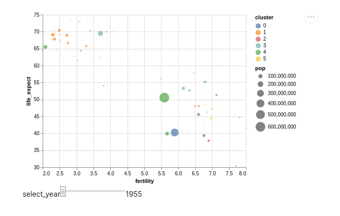
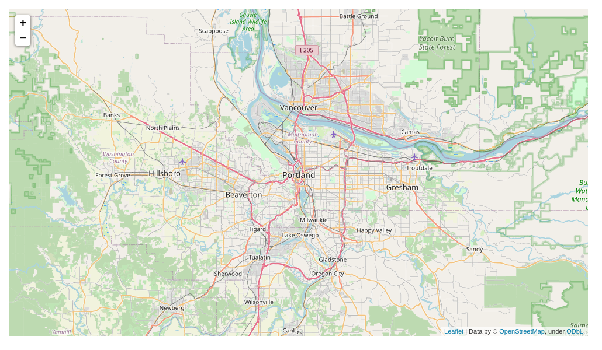
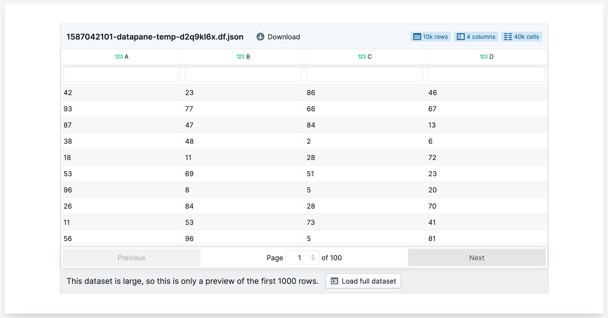
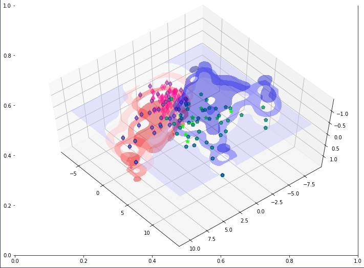

# Report Blocks

## Overview

Reports are comprised of multiple Blocks, which wrap up all kinds of useful Python objects for use in building your report, such as Pandas DataFrames, Visualisations, and Markdown. We are always adding new components, and if you have some ideas on what you would like to use in your reports, please [start an discussion on GitHub](https://github.com/datapane/datapane/discussions).

In this section we describe the Block types and provide examples, more detailed API usage can be found in our [API docs](https://datapane.github.io/datapane/report.html). 

## Plot

The `dp.Plot` block takes a plot object from one of the supported Python visualisation libraries and renders it in your report.

Datapane currently supports the following libraries:

| Library | Site / Docs |
| :--- | :--- |
| Altair | [https://altair-viz.github.io/](https://altair-viz.github.io/) |
| Matplotlib / Seaborn | [https://matplotlib.org/](https://matplotlib.org/) / [https://seaborn.pydata.org/](https://seaborn.pydata.org/) |
| Bokeh | [https://bokeh.org/](https://bokeh.org/) |
| Plotly | [https://plotly.com/python/](https://plotly.com/python/) |
| Folium | [https://python-visualization.github.io/folium/](https://python-visualization.github.io/folium/) |

### Altair

[Altair](https://altair-viz.github.io/) is a declarative statistical visualization library for Python, based on [Vega](http://vega.github.io/vega) and [Vega-Lite](http://vega.github.io/vega-lite). Altair’s API is simple, friendly and consistent and built on top of the powerful [Vega-Lite](http://vega.github.io/vega-lite) visualization grammar. This elegant simplicity produces beautiful and effective visualizations with a minimal amount of code.

To get started using Altair to make your visualizations, begin with Altair's [Documentation](https://altair-viz.github.io/)

```python
import altair as alt
import datapane as dp
from vega_datasets import data as vega_data
gap = pd.read_json(vega_data.gapminder.url)

select_year = alt.selection_single(
    name='select', fields=['year'], init={'year': 1955},
    bind=alt.binding_range(min=1955, max=2005, step=5)
)
alt_chart = alt.Chart(gap).mark_point(filled=True).encode(
    alt.X('fertility', scale=alt.Scale(zero=False)),
    alt.Y('life_expect', scale=alt.Scale(zero=False)),
    alt.Size('pop:Q'),
    alt.Color('cluster:N'),
    alt.Order('pop:Q', sort='descending'),
).add_selection(select_year).transform_filter(select_year)

dp.Report(dp.Plot(alt_chart)).publish(name='time_interval')
```



### Bokeh

Bokeh is an interactive visualization library which provides elegant, concise construction of versatile graphics, and affords high-performance interactivity over large datasets. 

To get started using Bokeh to make your visualizations, begin with Bokeh's [User Guide](https://docs.bokeh.org/en/latest/docs/user_guide.html#userguide).

```python
from bokeh.plotting import figure, output_file, show
from bokeh.sampledata.iris import flowers
import datapane as dp 

# Create scatter plot with Bokeh
colormap = {'setosa': 'red', 'versicolor': 'green', 'virginica': 'blue'}
colors = [colormap[x] for x in flowers['species']]

bohek_chart = figure(title = "Iris Morphology")
bokeh_chart.xaxis.axis_label = 'Petal Length'
bokeh_chart.yaxis.axis_label = 'Petal Width'

bokeh_chart.circle(flowers["petal_length"], flowers["petal_width"],
         color=colors, fill_alpha=0.2, size=10)

output_file("iris.html", title="iris.py example")

# View the plot
dp.Report(dp.Plot(bokeh_chart)).preview()

# Publish the report
dp.Report(dp.Plot(bokeh_chart)).publish(name='bokeh_plot')
```


### Matplotlib

[Matplotlib](https://matplotlib.org) is the original Python visualisation library, often supported and used with [Jupyter Notebooks](https://jupyter.org/). Matplotlib plots are not interactive in Datapane Reports, but are saved as SVGs so can be viewed at high fidelity.

Higher-level matplotlib libraries such as [Seaborn](https://seaborn.pydata.org/) are also supported, and can be used in a similar way to the matplotlib example below,

```python
import matplotlib.pyplot as plt
import pandas as pd
import datapane as dp

new_profile = pd.read_csv("data.csv")
top_followers = new_profile.sort_values(by='followers', axis=0, ascending=False)[:100]

fig = plt.figure()

plt.bar(top_followers.user_name,
       top_followers.followers)

dp.Report(dp.Plot(fig)).publish(name="matplotlib demo")
```


You can pass either a `matplotlib` `Figure` or `Axes` object to `dp.Plot`,  you can obtain the current global figure from `matplotlib` by running `plt.gcf()`



### Plotly

[Plotly's Python graphing library](https://plotly.com/python/) makes interactive, publication-quality graphs.

```python
import plotly.express as px
import datapane as dp

df = px.data.gapminder()

plotly_chart = px.scatter(df.query("year==2007"), x="gdpPercap", y="lifeExp",
	         size="pop", color="continent",
                 hover_name="country", log_x=True, size_max=60)
plotly_chart.show()

dp.Report(dp.Plot(plotly_chart)).publish(name='bubble')
```


### Folium

[Folium](https://python-visualization.github.io/folium/) makes it easy to visualize data that’s been manipulated in Python on an interactive leaflet map. It enables both the binding of data to a map for `choropleth` visualizations as well as passing rich vector/raster/HTML visualizations as markers on the map.

The library has a number of built-in tilesets from OpenStreetMap, Mapbox, and Stamen, and supports custom tilesets with Mapbox or Cloudmade API keys. 

```python
import folium
import datapane as dp 

m = folium.Map(location=[45.5236, -122.6750])


dp.Report(dp.Plot(m)).publish(name='folium_map')
```



## Markdown

**Markdown** is a lightweight markup language that allows you to include formatted text in your report.

```python
import datapane as dp

dp.Report(dp.Markdown("__My awesome markdown__"))
```

To include multi-line text and formatting the words, use triple-quoted string, e.g. `"""Some words"""`

```python
import datapane as dp

report = dp.Report(
           "## My Altair Plot",
           dp.Plot(alt_chart),
           dp.Markdown("""
* There is a negative relation between life expectanty and fertility
* The number of population with high life expactancy increases as time increase
           """)
report.publish(name = 'results')
```


You can also just pass strings directly into the `Report` and `Blocks` objects, or use `dp.Text`, an alias of `dp.Markdown`



Check [here](https://github.com/adam-p/markdown-here/wiki/Markdown-Cheatsheet) for more information on how to format your text with markdown.

### Markdown Tables

You can insert a Pandas dataframe in a Markdown block as nicely formatted table by using `df.to_markdown()`, or use the dedicated Table Block \(described below\) for larger data if you need sorting, filtering and more.

```python
import pandas as pd
import datapane as dp

df = pd.read_csv("data.csv")

dp.Report(dp.Markdown(df.to_markdown())
```

### Code

You can also share your code using `dp.Markdown` like below

```python
code = dp.Markdown(f'''
```df = data.reset_index().melt('Date', var_name='symbol', value_name='price')

base_chart = alt.Chart(df).encode(x='Date:T', y='price:Q', color='symbol').interactive()

chart = base_chart.mark_line() if plot_type == 'line' else base_chart.mark_bar()```
''')

dp.Report(code).publish(name='report_with_code')
```

## Table

The Table component takes a pandas DataFrame and renders an interactive, sortable, searchable table in your Datapane report. Viewers can also download the table from the website as a CSV file.


By default, a Table only displays the first 1000 rows, and gives the user the option to load the entire dataset -  datasets up to 1M cells are supported.


```python
import datapane as dp
import pandas as pd

df = pd.DataFrame({
    'A': np.random.normal(-1, 1, 5000),
    'B': np.random.normal(1, 2, 5000),
})

table = dp.Table(df)
report = dp.Report(table)
report.publish(name='sample_table')
```



## Files and Images

Datapane also enables you to share files and images. For example, to share your image, simply use `dp.File` like below

```python
dp.File(file=dp.Path('./image.png'))
```

And your image would appear on Datapane report automatically!



In a similar way, any other files can be embedded in your Datapane Report, including, for instance, Excel files, JSON data, text files and more. Furthermore, Datapane will attempt to display the files in your report for viewers and allow users to download them.

```python
import datapane as dp

report = dp.Report(
   dp.File("./image.png",
   dp.File("./data.xlsx",
   dp.File("./config.json")
   )
report.publish(name='Files Sample')
```


