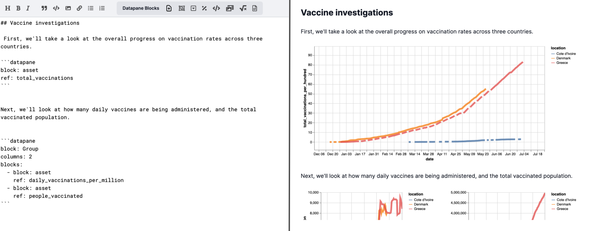

# Text Reports

‌One of the challenges with building reports in Python is working with long chunks of text. To make this easier, we've introduced a web-based Report editor where you can build rich long-form reports for articles or tutorials and seamlessly include interactive elements from your Python environment.



To get started, choose a template through the [Home](https://datapane.com/home/) page.&#x20;

You can also create a TextReport directly in Python by running the following code:&#x20;

```python
import datapane as dp
import altair as alt
from vega_datasets import data

source = data.cars()

plot1 = alt.Chart(source).mark_circle(size=60).encode(
    x='Horsepower', 
    y='Miles_per_Gallon', 
    color='Origin',
    tooltip=['Name', 'Origin', 'Horsepower', 'Miles_per_Gallon']
).interactive()

dp.TextReport(
  dp.Plot(plot1),
  dp.DataTable(source)
).upload(name="Hello world")
```


You'll need to be logged into [Datapane.com](http://datapane.com) or your Teams instance to use this feature - it is not currently supported on the open-source version.


## **Writing your first report**

You can get started writing straight away with Markdown - check out [this cheat sheet](https://www.markdownguide.org/cheat-sheet/) for more information or use the formatting icons at the top of the text area.

For example, try the following Markdown in the Text editor:

```
# This is a heading
**This is bold text**
*This is text in italics*
- These
- are
1. list
2. items
> This is a quote
[Click me](thisisalink.com)
```

This will generate a report which looks as follows:



## **Inserting blocks**

Aside from Markdown, you can enrich your report by adding special blocks,  For example, clicking on the Formula block will insert the following snippet into the web editor:

````
```datapane
block: Formula
formula: x^2 + y^2 = z^2
```
````

When you click 'Preview', you'll see this display as follows:&#x20;


You can edit the content inside the blocks, just make sure the parameters follow [YAML syntax](https://docs.ansible.com/ansible/latest/reference\_appendices/YAMLSyntax.html) (indentations can be tricky). For more information check out the pages about the block types:


[text-code-and-html.md](text-code-and-html.md)



[layout-pages-and-selects.md](layout-pages-and-selects.md)


### Uploading Blocks from Python

You can push up assets to your existing report from Python by passing in the report `id` to a TextReport object, like this:&#x20;

```python
dp.TextReport(df=df, plot=plot).upload(id="REPORT_ID")
```

‌(You'll need to replace `df` and `plot` with your own assets).&#x20;


Make sure to save your report before viewing or sharing it, otherwise you might lose your work!

