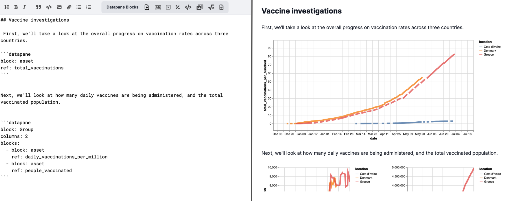

# Text Reports

‌One of the challenges with building reports in Python is working with long chunks of text. To make this easier, we've introduced a Markdown editor on the web, where you can build rich long-form reports for articles or tutorials and seamlessly include interactive elements from your Python environment.



To get started, create a report through the [Home](https://datapane.com/home/) or [My Reports](https://datapane.com/my-reports/) pages, and choose the 'Create Markdown Report' option.

You can also create a TextReport directly in Python by running the following code \(just make sure to pass in real objects for `df` and `plot`\): 

```python
dp.TextReport(df=df, plot=plot).upload(id="REPORT_ID")
```


You'll need to be logged into [Datapane.com](http://Datapane.com) or your Teams instance to use this feature - it is not currently supported on the open-source version.


## **Writing your first report**

You can get started writing straight away with Markdown - check out [this cheat sheet](https://www.markdownguide.org/cheat-sheet/) for more information or use the formatting icons at the top of the text area.

For example, try the following Markdown in the Text editor:

```text
# This is a heading
**This is bold text**
*This is text in italics*
- These
- are
1. list
2. items
> This is a quote
[Click me](thisisalink.com)
```

This will generate a report which looks as follows:



## **Inserting blocks**

Aside from Markdown, you can enrich your report by adding different blocks. 

**Datapane Blocks**

You can insert these blocks directly into your report from the editor, and edit the content inside the blocks \(parameters follow [YAML syntax](https://docs.ansible.com/ansible/latest/reference_appendices/YAMLSyntax.html)\). For example, clicking on the Formula block will insert the following snippet into the web editor:

```text
```datapane
block: Formula
formula: x^2 + y^2 = z^2
```
```

When you click 'Preview', you'll see this display as follows: 


For more information check out the pages about the block types:





**Python** **assets**

You can push up assets to your existing report from Python by passing in the report `id` to a TextReport object, like this: 

```python
dp.TextReport(df=df, plot=plot).upload(id="REPORT_ID")
```

‌\(You'll need to replace `df` and `plot` with your own assets\). 

As mentioned above, you can also create a Markdown Report directly from your Python script or notebook. In that case, you'll need to use the `name` parameter instead, as follows: 

```python
dp.TextReport(df=df, plot=plot).upload(name="My First Report")
```


Make sure to save your report before viewing or sharing it, otherwise you might lose your work!


