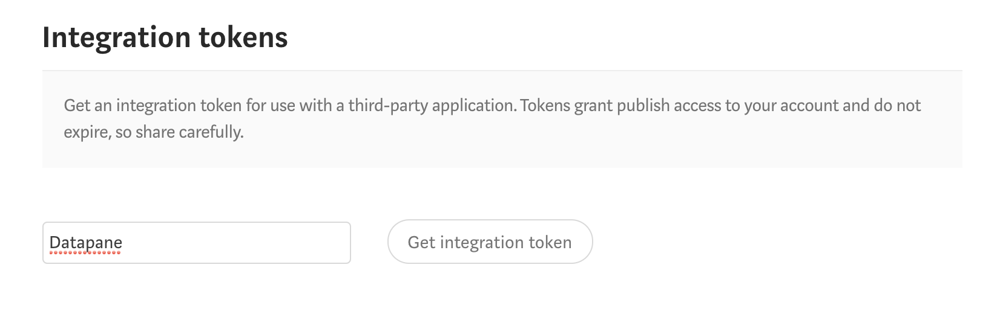
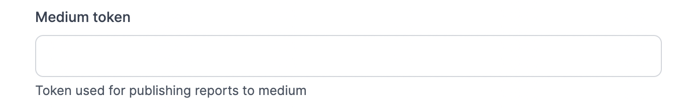
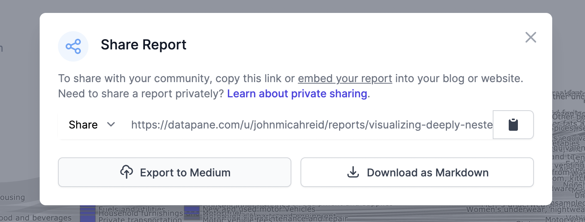

# Export to Medium

Write a lot on Medium? Datapane lets you convert your existing Datapane reports into Medium article drafts, preserving formatting and layout while making all visualizations interactive. 


If you just need to embed a public report or plot directly into a Medium article, see the section on [embedding](https://docs.datapane.com/reports/embedding-reports-in-social-platforms). This section is for converting Datapane reports into Medium drafts.   


The steps are as follows: 

1. **Get a Medium Integration token**

Go to Medium.com -&gt; Settings, then scroll down to 'Integration tokens'. Type a name ****like 'Datapane' into the input box, then click 'Get integration token' to create a new, 65-character token. 

**2. Copy Medium integration token into your Datapane Profile**

Copy this token and go to your Datapane settings page. Paste in the 'Medium token' input box, then hit 'Update'. 

**3. Share Report**

When you navigate to an existing report and click 'Share Report', you'll now see an option to 'Export to Medium'. Clicking on this will export the contents of your existing report to Medium as a draft \(just make sure that your report visibility is set to 'Public'\). You can edit the content further and publish on Medium once you're ready. Easy, right? 


This only works for publishing articles to your personal Medium profile. If you write for a publication like Towards Data Science, you'll need to check with the admin if you can get an integration token. 


