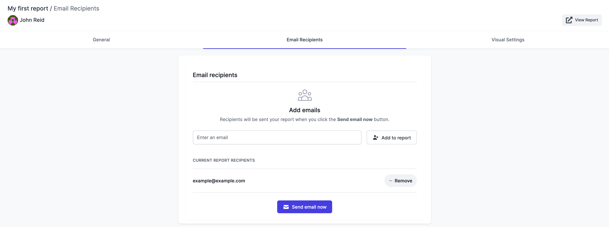

# Report Notifications

Datapane allows you to share copies of your report via email. To use this, go to your Report Settings -&gt; Email Recipients and enter your recipient email addresses. When you click 'Send Email Now' recipients will receive an email with a screenshot of the report plus a link back to the hosted report: 


Report notifications are the only way to share **private** reports on Datapane.com, but they can also be used to share **default** and **portfolio** reports. 


## Scheduled Report Notifications

If you have a report that you need delivered to stakeholders regularly e.g. a weekly sales report, [Datapane Teams](https://datapane.com/teams/) allows you to email recipients each time the report is updated. 

The mechanism is the same as for Community, except in addition to the 'Send Email Now' button, recipients will receive an email each time the report is updated. 

To learn how to schedule a report to update, check out our section on scheduling: 



