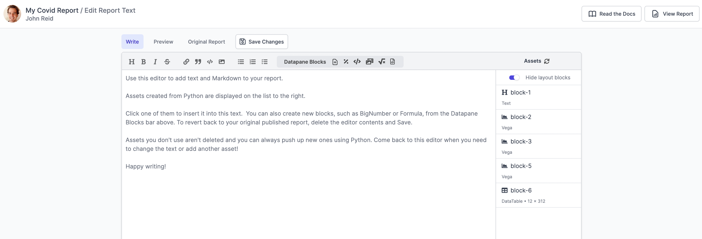
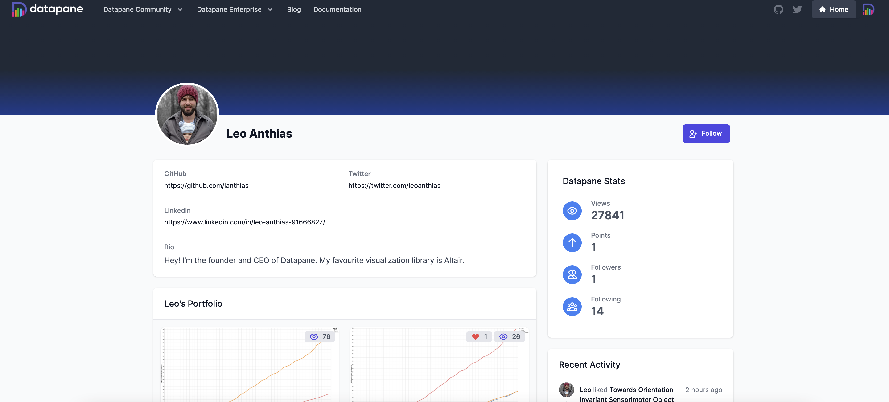
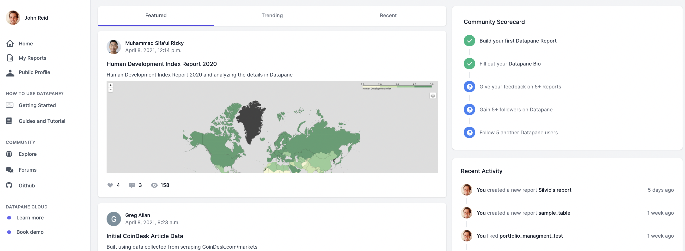
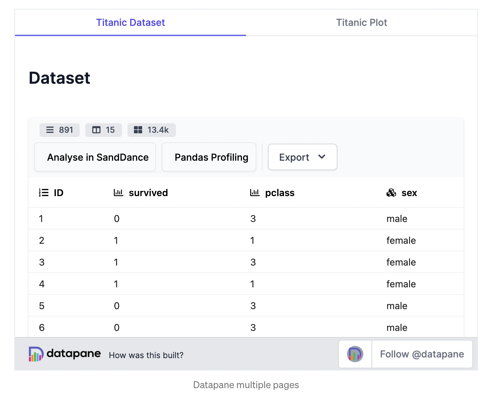
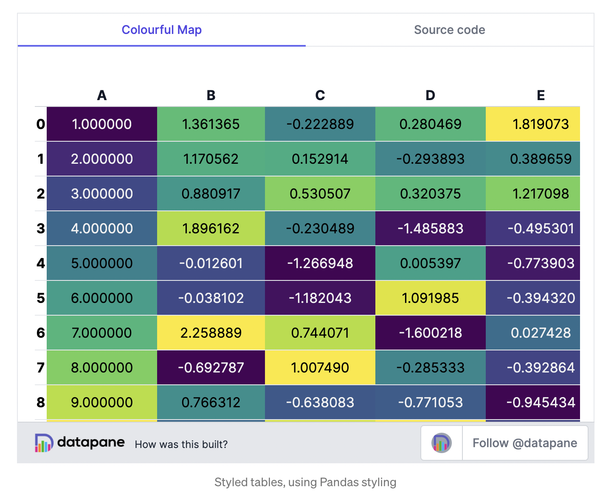
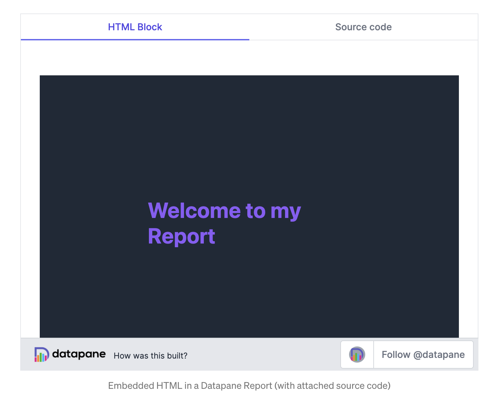
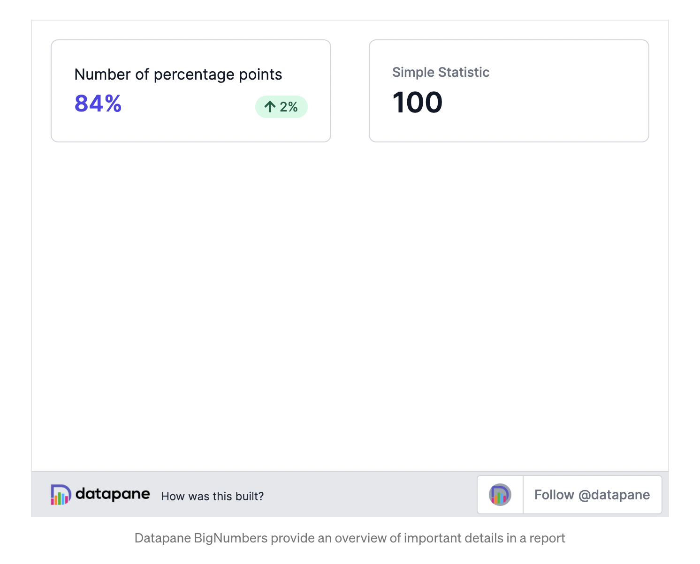

# Changelog

## 🚀 Coming Soon

* Create a TextReport directly from the web interface
* Better user management and onboarding for Datapane Teams
* Free trials of Datapane Teams
* Deploy an on-premise version of Datapane Teams

## 19 April 2021

#### Python version 0.11.0

### **🕸 Web editor** 

One of the challenges our users face is adding text to Python reports - it sucks to have to write long text strings and markdown directly from within your Python script/notebook. To solve this challenge, we've introduced a new web-based Markdown editor where you can edit the report once it's published. Simply write Markdown and insert your Python assets from the right sidebar. You can also use some of our nifty extra blocks, like LaTeX, HTML, BigNumbers etc. This makes it **much** easier to write blogs, articles, tutorials and other long-form content directly on [Datapane.com](http://datapane.com)!



## **31 March 2021**

### **👤 Profile redesign** 

One of the things Datapane users struggled with was finding a good place to showcase their skills to the community or prospective employees. They had GitHub for code and libraries, Medium for blogging, Kaggle for code-heavy ML, and LinkedIn for their work — but where does their data visualization and storytelling identity live? We’ve improved profiles on Datapane so users can showcase their skills. This might be the place where you link to from your CV or which people discover when they Google you. If you’re a current Datapane user, be sure to [update your bio](https://datapane.com/settings) and choose some high quality reports so that it does you justice!



### **🗞 Newsfeed**

Our first versions of Datapane didn’t take into account that users wanted to talk to **learn from each other** — the product was quite insular to each individual user. Our first change to solve this is to add a newsfeed so that you can see what is happening in the Datapane Community, get more visibility on your reports, and learn techniques from others. Check your your [own Datapane newsfeed](https://datapane.com/home). As your reports increase in visibility, it’s more important than ever to include proper context and source-code, so the community can see how you’ve built your report and offer any tips.



### **🦯 Guides** 

We have added a new [**Guides and Tutorials**](https://datapane.com/guides-and-tutorials/) section to the product, which you can check out. It’s a work in progress, and we would love community-contributions. Want to show-case your skills? Create a guide or tutorial as a Datapane report and tag it like this:

```text
dp.Report(...).publish(name='My guide', tags=['guide'])
```

And it will appear in our guides section. Stay tuned as we improve the knowledge sharing aspects of the product, which we know are really important to many of you.

## 23 December 2020

#### Python version 0.**9**.0

### **✍️ Text-centric reports**

One of the things people struggled with when creating text-heavy reports on Datapane was having to write reports as lists of strings and plots. Interspersing Markdown and plots works well if you have a few headings, but it’s hard when you are writing a text-rich report — such as a blogpost or article. To make this easier, our first idea was to build a web text-editor; but, from speaking to users, we learned that many of them were comfortable with Markdown and had a local editor already.

In response to this feedback, we’ve added a `format` option, which allows you to write a single block of Markdown \(either in your report, or in a separate file\), and template it with your other blocks.

To do this, use double braces to specify where you want your other blocks to appear throughout your text. Alternatively, you can write your whole post in your favourite local Markdown editor, and import the file:

```text
dp.Report(
  dp.Text(file='markdown.md').format(
    plot=plot,
  )
).publish(name='altair_example')
```

We hope that this will made it easy for users to build text-rich whitepapers, articles, and blogposts using Markdown, Python, and Datapane.

### **📄 Pages and Layouts**

When we first released Datapane, it only supported a list of blocks and a single column — not a million miles off of a Jupyter Notebook. Many users needed a way to build more flexible grid components, and in October we released our layout features to allow the building of grid layouts.

We’re pleased to announce we’re adding a great new feature to this: Pages. Pages do what they say in the tin, and allow you to have multiple pages in your report which your users can navigate through tabs — without writing any HTML or CSS!

We’ve been using this internally to create multiple scenarios, add full source code to reports, and single reports which previously would have had to be multiple reports.


### **🗂 Dropdowns and Tabs**

Pages work at the top-level of the report, and many users also wanted to have dynamic components inside of reports — such as tabs and drop-downs.

What if we want our titanic data above, but want to allow the user to choose whether they wanted to view the whole dataset, or a description of the dataset? Instead of making you include them both side by side, we’ve added `dp.Select`, which takes other blocks and turns them into tabs or drop downs.



This is also a great block for showing the source code behind a plot or dataset for documentation \(which most of your viewers may not want to see\). For instance, to see the source code of the `Select` component, click on the "Source code" tab.

Part of Datapane’s mission is to be completely standalone, so none of these interactive elements require you to run or maintain a Python server — your report is pure HTML. You can publish them on [datapane.com](https://datapane.com/) for free, embed them into your own site, or export them and host them on a static site such as GitHub pages.

### **🧮 Better Tables**

Our primary Table component was built for large data with interactive filtering and sorting. We thought this was going to be the most common format, but learned that it isn’t always the best option — many users wanted more styled display-focused tables, where they could show correlations, embed bar charts and histograms, and highlight anomalies, instead of a way to display millions of cells.

Many users were using our Markdown component to build a table, and we looked at building our own, before settling on supporting Pandas HTML tables. This allows us to support [Pandas Styling](https://pandas.pydata.org/pandas-docs/stable/user_guide/style.html) and is a natural fit for our HTML reports, making it simple to build beautiful styled tables like this:



As part of this, we are making this the default `Table` component, and renaming our interactive component for larger datasets as `DataTable`.

### **HTML**

Although users like being able to create reports without touching HTML, sometimes it’s helpful to be able to pull in another UI library or custom component — for instance, maybe you want to include your company’s logo or styling. To allow this for power users, we’ve added an HTML component which you can use anywhere in your Datapane report. You can also use the [dominate library](https://github.com/Knio/dominate/) to create HTML directly from python code.



### **Big Number**

Sometimes one statistic or KPI is the most important thing in your report — and we had a few users who were missing this from their BI tools. To save you the trouble of building one using HTML, we’ve included a `BigNumber` component for you \(built with the amazing [TailwindCSS](https://tailwindcss.com/) library\).




