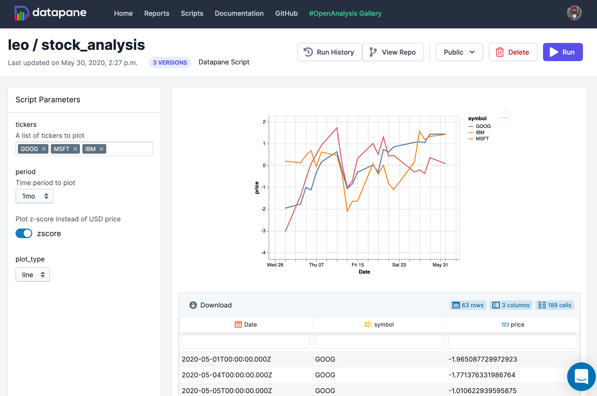

# Deploying a Script

## Overview

In the [previous section](tut-creating-a-report.md), we explored the building and sharing a report programmatically using the Datapane library in your Python script. This tutorial shows you how to run and deploy this script \(or Jupyter Notebook\) via a Datapane hosted instance so that other people can use it to dynamically generate their own reports. 

Scripts are created by deploying your Python code or Jupyter Notebook using Datapane's CLI. They can be shared and are exposed to users through web forms which can be run in the browser. This means that people can generate reports without worrying about code, notebooks, or setting up a Python environment. The parameters from these web forms are passed into your Python code at runtime.



## Deploying a script

If you have a local Python script or notebook which creates a report using Datapane's `Report.publish` method \(see [Creating a Report](tut-creating-a-report.md)\), you can upload it straight to Datapane using the CLI. Let's take the following code which pulls stock data from Yahoo finance and deploy it using Datapane's CLI. The report we publish in this code will be returned to the user when they run our script using the Datapane web interface.


We recommend creating only one report per script. As many can be created as needed; however, only the last one in each script will be tracked in the web interface.



```python
import pandas as pd
import altair as alt
import datapane as dp

from scipy.stats import zscore

tickers = ['GOOG']
dfs = []

for t in tickers:
    t_df = pd.read_csv(f'https://query1.finance.yahoo.com/v7/finance/download/{t}?period1=1553600505&period2=1585222905&interval=1d&events=history')
    t_df['ticker'] = t
    dfs.append(t_df)

stock_data = pd.concat(dfs)
stock_data['Date'] = pd.to_datetime(stock_data['Date'])
stock_data['zscore'] = stock_data.groupby('ticker')['Close'].transform(lambda x: zscore(x))

plot = alt.Chart(stock_data).encode(x='Date:T',y='zscore', color='ticker').mark_line()

report = dp.Report(
    dp.Markdown("## Stock Report"),
    dp.Table(stock_data),
    dp.Plot(plot)
 )
 
 report.publish(headline='Financial Report', name='financial_report')
```


To deploy it, use Datapane's CLI.

```bash
$ datapane script deploy --script=financial_report.py --name=finance_report
Script created: https://datapane.com/leo/scripts/finance_report/
```

This makes your script available on [datapane.com](https://datapane.com/) \(or your private instance\).


When a user runs your script, they will be able to generate the report from the previous example dynamically. For this specific report, this isn't particularly helpful yet, as it is similar each time. Next, we will make it dynamic by configuring it with some parameters which users can send into our code.


You can run your script from the web, from the command line, or using the API -- for instance through a Github action. This tutorial will focus on running your script through the web interface.



